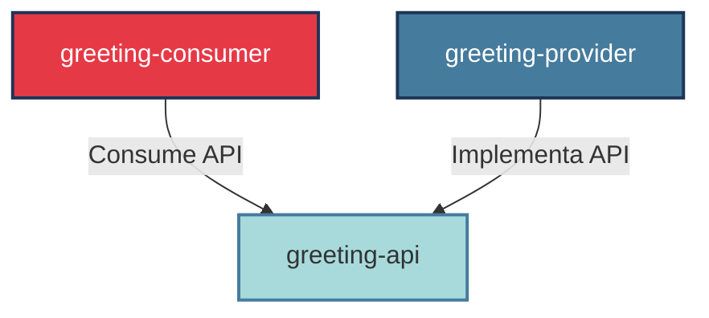

# 🚀 Demostración de Arquitectura Modular con OSGi & Apache Karaf

¡Bienvenido! Este repositorio contiene la implementación práctica de un sistema modular bajo la especificación **OSGi (Open Services Gateway initiative)** desplegado sobre el contenedor **Apache Karaf**. El proyecto está estructurado con Maven y demuestra los principios de bajo acoplamiento, modularidad estricta e inyección de dependencias dinámicas en tiempo de ejecución.

---

## 🏗️ Arquitectura del Sistema

El proyecto `osgi-greeting-demo` está diseñado bajo un enfoque multi-módulo que separa la especificación (API) de las implementaciones y consumidores. Consta de tres componentes clave (Bundles):



1.  **`greeting-api`**: Define la interfaz común `IGreetingService` para la comunicación del servicio. Exporta su paquete para que sea visible en el framework OSGi.
2.  **`greeting-provider`**: Implementa `IGreetingService` y se registra dinámicamente en el Service Registry de OSGi utilizando *OSGi Declarative Services* (SCR).
3.  **`greeting-consumer`**: Expone un comando interactivo (`greeting:saludar`) en la consola de Apache Karaf, resolviendo dinámicamente el servicio del proveedor mediante inyección de dependencias.

---

## 🛠️ Requisitos Previos

Para compilar y ejecutar este proyecto de forma estándar, necesitas:
*   **Java SE Development Kit (JDK) 11** o superior.
*   **Apache Maven 3.6.0** o superior.
*   **Apache Karaf 4.4.x** (contenedor OSGi).

*(Nota: En este entorno de desarrollo local, se utilizaron las herramientas en `C:\Users\quinc\Documents\Arquitectura\jdk11` y `C:\Users\quinc\Documents\Arquitectura\maven`).*

---

## 💻 Guía de Uso Paso a Paso

Sigue estas instrucciones secuenciales en tu terminal para compilar, iniciar y probar el sistema.

### Paso 1: Compilar el Proyecto
Usa Maven para compilar todos los subproyectos y generar los archivos JAR listos para OSGi. Ejecuta esto en la raíz del proyecto `osgi-greeting-demo`:

```bash
cd osgi-greeting-demo
mvn clean install
```

*(Si utilizas el entorno de desarrollo local con PowerShell, configura las variables de entorno de la siguiente manera):*
```powershell
cd C:\Users\quinc\Documents\Arquitectura\osgi-greeting-demo
$env:JAVA_HOME="C:\Users\quinc\Documents\Arquitectura\jdk11\jdk-11.0.31+11"
& "C:\Users\quinc\Documents\Arquitectura\maven\apache-maven-3.9.6\bin\mvn.cmd" clean install
```

### Paso 2: Iniciar Apache Karaf
Abre tu contenedor Karaf. Se recomienda usar la bandera `clean` para limpiar la caché interna y asegurar una carga limpia:

```bash
# Navega al directorio de instalación de Karaf y ejecuta:
./bin/karaf clean
```

### Paso 3: Instalar las Dependencias y los Bundles en Karaf
Dentro de la consola interactiva de Apache Karaf (`karaf@root()>`), ejecuta los siguientes comandos en orden:

```sql
# 1. Instalar el soporte para Declarative Services (SCR)
feature:install scr

# 2. Instalar el bundle de la API (Contrato)
install -s file:///C:/Users/quinc/Documents/Arquitectura/osgi-greeting-demo/greeting-api/target/greeting-api-1.0.0.jar

# 3. Instalar el bundle del Proveedor (Implementación)
install -s file:///C:/Users/quinc/Documents/Arquitectura/osgi-greeting-demo/greeting-provider/target/greeting-provider-1.0.0.jar

# 4. Instalar el bundle del Consumidor (Comando interactivo)
install -s file:///C:/Users/quinc/Documents/Arquitectura/osgi-greeting-demo/greeting-consumer/target/greeting-consumer-1.0.0.jar
```

### Paso 4: Verificar la Instalación
Verifica que los tres bundles estén instalados y en estado `Active`:

```sql
list | grep -i greeting
```

Deberías ver una salida similar a esta:
```text
[ID] │ Active │ [Lvl] │ [Versión] │ Nombre del Bundle
─────────────────────────────────────────────────────────────────────────────
 57  │ Active │  80   │ 1.0.0     │ OSGi Greeting Demo :: API
 58  │ Active │  80   │ 1.0.0     │ OSGi Greeting Demo :: Provider
 59  │ Active │  80   │ 1.0.0     │ OSGi Greeting Demo :: Consumer
```

---

## ⚡ Demostración de Dinamismo (Parada y Arranque en Caliente)

OSGi destaca por su gestión del ciclo de vida en caliente sin interrumpir el runtime de la aplicación. Podemos comprobarlo de la siguiente manera:

### 1. Prueba de Ejecución Normal
Ejecuta el comando personalizado creado por nuestro consumidor:
```sql
greeting:saludar Erick
```
**Salida esperada:**
```text
Hola, Erick! Saludo desde GreetingProvider (Bundle activo).
```

### 2. Simulación de Falla (Parada en Caliente)
Detén el bundle del proveedor (`greeting-provider`) usando su ID (por ejemplo, el ID `58` obtenido en el comando `list`):
```sql
stop 58
```
Verifica la lista de bundles (`list | grep -i greeting`). Observarás que el proveedor ahora está en estado `Resolved` (inactivo).

Intenta ejecutar el comando de saludo nuevamente:
```sql
greeting:saludar Erick
```
**Resultado:**
```text
Command not found: greeting:saludar
```
*Explicación:* Karaf detecta en tiempo real que el servicio requerido por el consumidor ya no se encuentra registrado. En lugar de arrojar un error crítico de ejecución (`NullPointerException`), desregistra dinámicamente el comando de la shell, asegurando la tolerancia a fallos del sistema.

### 3. Recuperación del Servicio (Arranque en Caliente)
Reinicia el bundle del proveedor:
```sql
start 58
```
Ejecuta el comando otra vez:
```sql
greeting:saludar Erick
```
**Salida esperada:**
```text
Hola, Erick! Saludo desde GreetingProvider (Bundle activo).
```
*Explicación:* El framework detecta la republicación del servicio y re-inyecta automáticamente la referencia al consumidor de forma transparente en caliente.

---

## 📁 Estructura del Código Fuente

*   `greeting-api/`: Interfaces públicas (`IGreetingService`).
*   `greeting-provider/`: Clases implementadoras anotadas con `@Component`.
*   `greeting-consumer/`: Acciones de Karaf anotadas con `@Command` y `@Service`, e inyecciones `@Reference`.
*   `pom.xml`: Archivo Maven padre que coordina la compilación e inyecta los plugins de Bnd para la generación del manifiesto OSGi.
